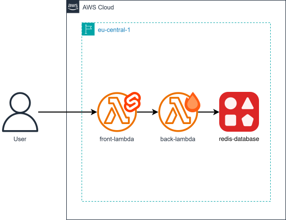

# cdktn-aws-sveltekit-hono-lambdaliths

CDKTN app that deploys SvelteKit and Hono Lambdaliths along with an Upstash Redis database to AWS.

This app leverages the [AWS Lambda Web Adapter](https://github.com/aws/aws-lambda-web-adapter) with Lambda Function URLs.

## Prerequisites

- **_AWS:_**
  - Must have authenticated with [Default Credentials](https://registry.terraform.io/providers/hashicorp/aws/latest/docs#authentication-and-configuration) in your local environment.
- **_Upstash:_**
  - Must have set the `UPSTASH_EMAIL` and `UPSTASH_API_KEY` variables in your local environment.
- **_mise:_**
  - [Install mise](https://mise.jdx.dev/installing-mise.html), which manages Node, pnpm, and OpenTofu.
- **_Docker:_**
  - Must be [installed](https://docs.docker.com/get-docker/) in your system and running at deployment.

## Installation

```sh
mise install
pnpm install
pnpm gen
```

`pnpm gen` generates the AWS, Docker, and Upstash provider constructs into `.gen/`. Re-run it whenever a provider constraint in `cdktf.json` changes.

The Hono backend in `src/functions/back` and the SvelteKit frontend in `src/functions/front` are standalone projects with their own lockfiles; Docker builds them, so they are not part of this workspace.

## Deployment

```sh
pnpm deploy
```

## Cleanup

```sh
pnpm destroy
```

## Application Details

- `back-lambda`
  - Environment variables:
    - `REDIS_URL` - Address of the Redis database in the form of `rediss://<user>:<psw>@<host>:<port>`
  - Port bindings:
    - `3000`
  - Endpoints:
    - `/` - Hello message display
    - `/ping` - Returns static "pong" response (used for readyness check)
    - `/api/clicks` - Returns current click count
    - `/api/clicks/incr` - Increments click count by 1 and returns new click count
- `front-lambda`
  - Environment variables:
    - `BACKEND_URL` - Address of the backend service reachable from the server side in the form of `https://<host>`
  - Port bindings:
    - `3000`
  - Endpoints:
    - `/`  - Click counter display
    - `/ping` - Returns static "pong" response (used for readyness check)

## Architecture Diagram


